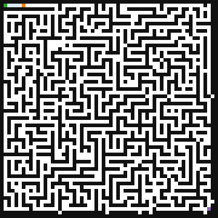
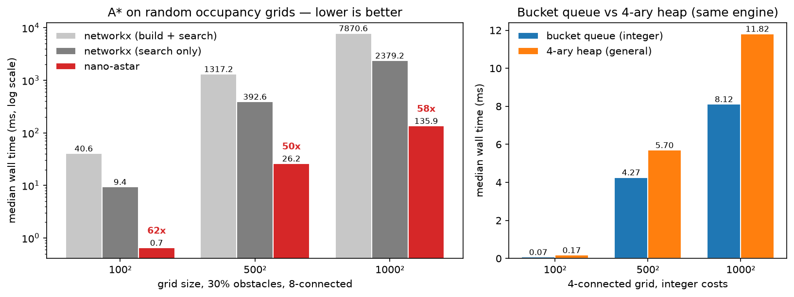
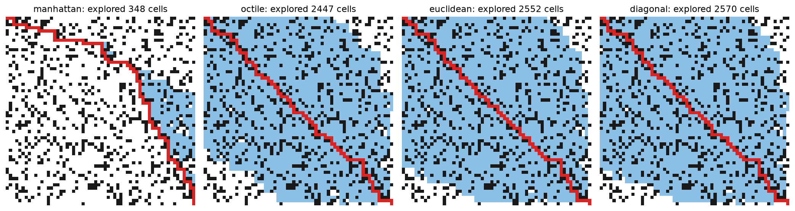

# nano-astar

**[中文文档 → README.zh.md](README.zh.md)**

[](https://github.com/nano-astar/nano-astar/actions/workflows/ci.yml)
[](LICENSE)
[](https://www.python.org)

**A* pathfinding on occupancy grids with a C++ core — measured 14–17× faster than networkx search alone, 50–62× faster including graph construction** ([BENCH.md](BENCH.md) for the exact numbers, environment and reproduction script).



## Why nano-astar

- **Fast where it matters.** The search core is C++17 with cache-friendly flat arrays: one byte per cell for the closed bitmap, intrusive per-node links — no hash maps, no per-node allocation.
- **Two open lists, chosen automatically.** 4-connected integer grids run on a **bucket queue** with O(1) amortized push/pop and true decrease-key; float costs (8-connected `sqrt(2)` diagonals) fall back to a **4-ary heap**. Measured on identical integer workloads the bucket queue is **1.3–2.4× faster** than the heap ([BENCH.md](BENCH.md)).
- **Real multithreading.** The GIL is released for the entire search (`nb::call_guard<nb::gil_scoped_release>`), so threads truly run in parallel — measured **2.9× on 4 threads** ([test_gil_released_under_threads](tests/test_api.py)).
- **Zero-copy numpy in, numpy out.** A contiguous `uint8` grid is passed to C++ without copying; the path comes back as an `(n, 2)` `int32` array.
- **One dependency.** Runtime: `numpy` only. Bindings via [nanobind](https://github.com/wjakob/nanobind), build via scikit-build-core.
- **Battle-tested against a reference implementation.** 200 randomized grids are differentially tested against networkx A* — reachability and optimal cost must match exactly (integer) or within 1e-6 (float) ([tests/test_correctness.py](tests/test_correctness.py)).

## Install & 30-second quickstart

```bash
pip install nano-astar        # from PyPI (once published)
pip install .                 # from a source checkout
```

```python
import numpy as np
from nano_astar import astar

grid = np.zeros((100, 100), dtype=np.uint8)
grid[20:80, 50] = 1                       # a wall

result = astar(grid, (0, 0), (99, 99), heuristic="octile", diagonal=True)
if result is None:
    print("unreachable")
else:
    path, cost = result                   # path: (n, 2) int32 (row, col)
    print(f"{len(path)} cells, cost {cost:.3f}")

# exploration history for animations:
path, cost, history = astar(grid, (0, 0), (99, 99), return_history=True)
```

Terminal demo: `python examples/demo.py`

## Benchmarks

Random grids with 30% obstacles, 8-connected moves, octile heuristic on both
sides, medians after warmup. Full table, fairness notes and the reproduction
script: [BENCH.md](BENCH.md). Environment: Python 3.11.15, networkx 3.6.1,
numpy 2.4.6, MSVC 19.51 (`/O2`), Windows 11.

| grid | nano-astar | networkx (search only) | networkx (build + search) | speedup (search) | speedup (incl. build) |
|---|---|---|---|---|---|
| 100×100 | 0.65 ms | 9.4 ms | 40.6 ms | 14× | 62× |
| 500×500 | 26.2 ms | 392.6 ms | 1317.2 ms | 15× | 50× |
| 1000×1000 | 135.9 ms | 2379.2 ms | 7870.6 ms | 17× | 58× |

Costs cross-checked against networkx on every run: identical within 1e-6.



Reproduce:

```bash
python tests/bench_vs_networkx.py   # rewrites BENCH.md + docs/bench_results.json
python tools/make_plots.py          # regenerates the charts
```

## Heuristics, visualized

Same map, four built-in heuristics (4-connected). Blue = cells explored,
red = final path. A tighter heuristic explores less — all four still return
the same optimal cost.



## When NOT to use nano-astar

- **General graphs.** Nodes with attributes, edge weights, or non-grid
  topology are out of scope — the input is a binary occupancy grid, period.
  Use networkx, rustworkx, or a graph library.
- **Custom Python heuristics.** There is no callback interface: the four
  built-in heuristics run inline in C++, which is exactly where the speed
  comes from. If you need a domain-specific heuristic, fork and add it in
  `src/cpp/heuristics.hpp`.
- **Weighted terrain.** All free cells cost the same (1 orthogonally,
  `sqrt(2)` diagonally). Costmaps with per-cell traversal costs need a
  different engine.
- **When the bucket queue won't help you.** The bucket queue only engages
  for 4-connected integer-cost grids (`diagonal=False`). With
  `diagonal=True`, costs are irrational multiples of `sqrt(2)` and the
  engine uses the 4-ary heap instead — by design, not by accident. On
  integer grids the bucket queue is 1.3–2.4× faster (measured,
  [BENCH.md](BENCH.md)); if your workload is 8-connected, that is the
  number you give up.
- **`manhattan` with `diagonal=True`.** Manhattan overestimates on
  8-connected grids and silently returns suboptimal paths. Use `octile`
  (the default) there.

## API

```python
astar(grid, start, goal, heuristic="octile", diagonal=True,
      return_history=False) -> (path, cost) | (path, cost, history) | None
```

| parameter | meaning |
|---|---|
| `grid` | 2-D array-like; `0` = free, nonzero = obstacle. Contiguous `uint8` is zero-copy; other dtypes are converted once via `grid != 0`. |
| `start`, `goal` | `(row, col)` cell indices. |
| `heuristic` | `"octile"` (default, tightest for 8-conn), `"manhattan"` (tightest for 4-conn), `"euclidean"`, `"diagonal"`. All inline C++, no Python callback. |
| `diagonal` | `True`: 8-connected, diagonal steps cost `sqrt(2)`, no corner cutting. `False`: 4-connected unit costs → integer bucket-queue engine. |
| `return_history` | Also return the closed cells in pop order as `(m, 2)` int32 — what the GIF above is made of. |

- **Returns** `None` when no path exists (never raises for that).
- **Raises `ValueError`** for out-of-bounds or on-obstacle `start`/`goal`,
  non-2-D grids, and unknown heuristic names.
- Path cost is exact: integer grids return integer-valued floats, 8-connected
  grids return exact sums of `1`/`sqrt(2)` terms.
- Thread-safe and GIL-free: no Python objects are touched while the GIL is
  released, and concurrent calls from multiple threads run truly in parallel.

## Development

```bash
uv venv --python 3.11 .venv
uv pip install --python .venv -e ".[dev]"
pytest tests/                          # 220 tests, differential vs networkx
python tests/bench_vs_networkx.py      # regenerate BENCH.md
python tools/make_gif.py               # regenerate docs/demo.gif
```

Layout:

```
src/cpp/astar.cpp         engine + nanobind bindings
src/cpp/bucket_queue.hpp  ring bucket queue (integer costs, O(1) decrease-key)
src/cpp/heap4.hpp         4-ary heap (float/general costs)
src/cpp/heuristics.hpp    octile / manhattan / euclidean / diagonal, inline
src/python/nano_astar/    Python wrapper (validation, dtype normalization)
tests/                    differential tests, API tests, benchmark
tools/                    smoke test (pure C++), GIF/chart generators
```

## License

MIT — see [LICENSE](LICENSE).
